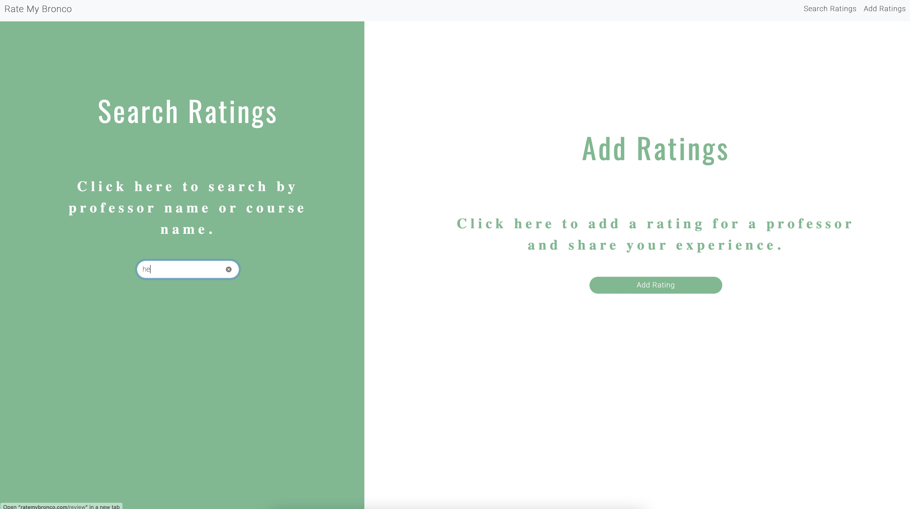

# [RATE MY BRONCO](http://ratemybronco.com)

## Problem
- The data on other websites is not specific to Cal Poly Pomona
- Most of their data is outdated for example our Semester Conversion & Curriculum Changes are not reflected
- Newer professors and classes may have very little or no reviews.
- Reviews alone are not enough; we need accurate data on class grades and distributions

## Our Solution
- we created something simple and easy to navigate quickly and get what you need.
- our solution is to display grades based on course and professor so that the students can get a better picture of the class and the difficulty level.
- our data is based on the official data set provided by CPP.
- the rating is anonymous.
- we calculate ratings based on a specific class or professor.

